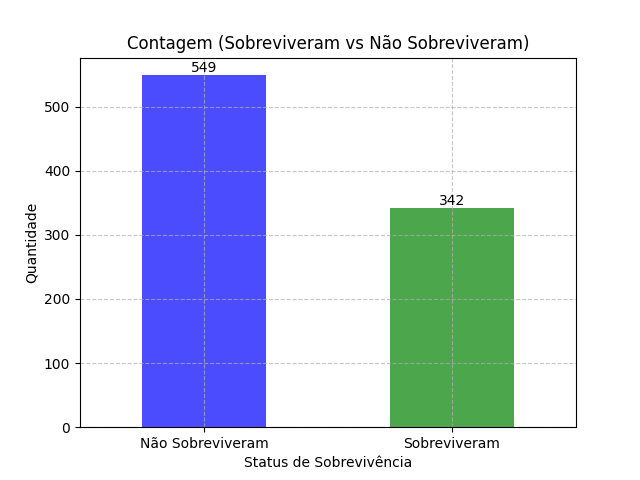
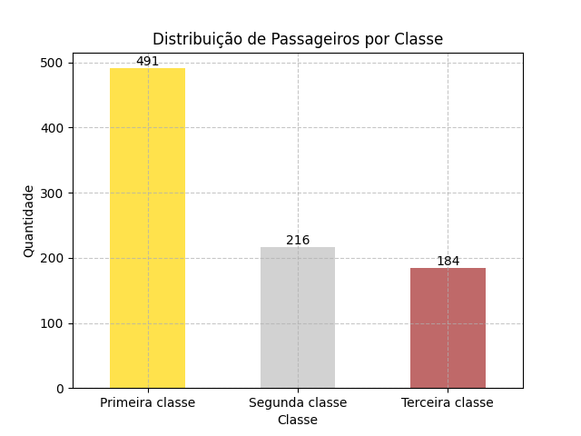

## Análise da Coluna 'Survived'

A coluna 'Survived' indica se um passageiro sobreviveu (1) ou não (0) ao desastre do Titanic.

### Distribuição

A maioria dos passageiros (61.62%) não sobreviveu ao desastre.

### Taxa de Sobrevivência Geral

A taxa de sobrevivência geral foi de 38.38%.

### Insights Principais

* A taxa de sobrevivência foi relativamente baixa, indicando a gravidade do desastre.

## Análise da Coluna 'Pclass'

A coluna 'Pclass' indica qual a classe do passageiro  (Primeira classe, Segunda classe, Terceira classe)

### Distribuição

A maioria dos passageiros (55.11%) estavam na Primeira classe.

### Taxa de Sobrevivência Geral

* Primeira Classe: 55.11%
* Segunda Classe: 24.24%
* Terceira Classe: 20.65%

### Insights Principais

* *Passageiros da Primeira Classe tiveram a maior taxa de sobrevivência.*
* *Passageiros da Terceira Classe tiveram a menor taxa de sobrevivência.*
* *A coluna 'Pclass' tem uma forte correlação com a coluna 'Fare' (tarifa).*

### Próximos Passos

* Analisar outras colunas do conjunto de dados.
* Explorar as relações entre as colunas.